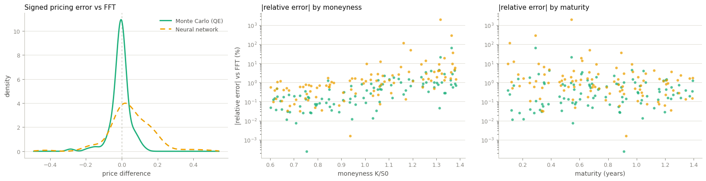
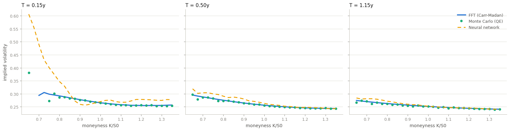

# Heston Numerical Methods Comparison

This project compares three numerical methods for pricing European call options under the Heston model: the Carr–Madan FFT approach, Monte Carlo simulation using the Quadratic Exponential (QE) scheme, and a neural-network-based approximation.  
The datasets are synthetic and generated via Latin Hypercube Sampling (LHS), ensuring efficient coverage of the model’s parameter space. This choice reflects the purpose of the project, which is to explore the behavior, strengths, and limitations of the different pricing approaches rather than to declare a definitive “winner”. 

It is worth noting that for standard European options, the Heston model admits semi-analytical solutions (like the FFT) that render computationally intensive methods (such as MC and NN) redundant in practice. Therefore, the use of European options in this study is strictly intended as a controlled validation framework, allowing us to benchmark the alternative methods against a reliable exact solution before extending them to more complex derivatives.

The three techniques are evaluated in terms of **execution time** and **pricing accuracy**, using the FFT solution as the reference benchmark.  
The results show that the neural network is the fastest method, at the cost of a higher error and larger error variance.  
Monte Carlo, while significantly slower, produces prices that are very close to the Carr–Madan benchmark and exhibits greater stability in its error distribution.


### ENVIRONMENT

The timings reported below are hardware-dependent and were measured on:

- **CPU**: AMD Ryzen 7 5800U (8 cores / 16 threads)
- **RAM**: 16 GB
- **OS**: Windows 11 Business
- **Python**: 3.12.10


To reproduce the environment:
```bash
pip install -r requirements.txt
```


### RESULTS

The three approaches each exhibit a distinct strength. 
- The Carr–Madan FFT method is fast and accurate, but only when the model and payoff admit the analytical structure it relies on, it's "elegant" but definitely not elastic. 
- Monte Carlo, in contrast, is the most general, flexible and robust technique: it works for any payoff and model specification, though at the cost of **substantially higher computational time**. 
- Neural networks offer unmatched speed once trained, making them ideal for real-time or high-frequency applications, but **their reliability is limited to the domain covered during training** and they provide no strict numerical guarantees outside it.

Naturally, all of these methods remain considerably slower than Black–Scholes, which benefits from a closed-form solution.


|                | avg_time | avg_error  | std_error |
|----------------|----------|------------|-----------|
| Carr-Madan FFT | 0.00163s  | 0         | 0         |
| Monte Carlo QE | 0.03987s  | 0.0331    | 0.044     |
| Neural Network | 0.00009s  | 0.0919    | 0.092     |


#### ERRORS: 

The left panel shows the *signed* pricing error against the FFT benchmark. Monte Carlo is a narrow, unbiased distribution centered at zero (pure sampling noise, as expected from an unbiased estimator). The neural network's error distribution is wider and skewed to the right: it is not just noisier, it carries a systematic positive bias (it tends to overprice).

The middle and right panels show the *relative* error against moneyness and maturity, on a log scale. Both methods degrade as options move out-of-the-money (moneyness above ~1.1–1.2), where the option price itself approaches zero and small absolute errors translate into large relative ones. Maturity, by contrast, shows no clear trend: it is moneyness, not time to expiry, that stresses both methods. Across the board the neural network's errors sit roughly an order of magnitude above Monte Carlo's.



#### SMILES 

Prices are converted to Black–Scholes implied volatility and plotted against moneyness at three maturities, using one representative Heston parameter set inside the neural network's training domain. This view amplifies errors that are invisible in price space, particularly where vega is small.

At the shortest maturity (T = 0.15y) the neural network departs sharply from the true smile on the deep in-the-money side, overshooting the implied volatility by several volatility points (that's a sign of poor extrapolation near the edge of its training domain). Monte Carlo instead scatters randomly around the FFT curve with no systematic pattern, consistent with the unbiased noise seen in the error panel above. As maturity increases, vega grows, the smile flattens, and all three methods converge visually; the same errors are still present in price space, but they no longer show up at the scale of implied volatility.



